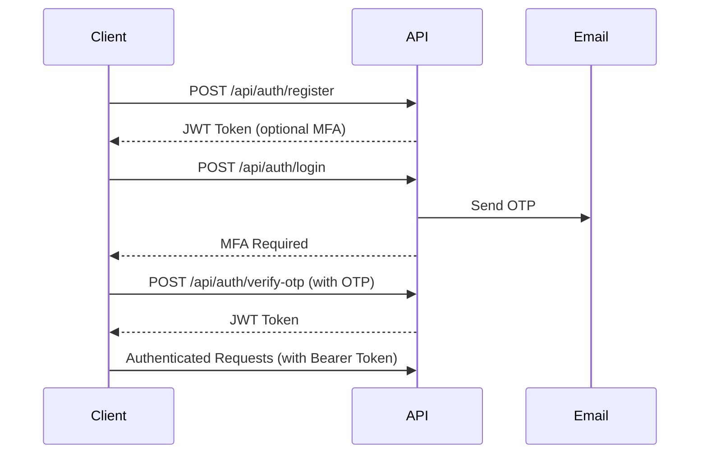

# API Reference - Quick Guide

## 🔐 Authentication Flow

### 1. Register → 2. Login → 3. Verify OTP → 4. Use JWT Token



## 📋 Quick Reference

### Base URL
```
http://localhost:8080
```

### Authentication Header
```
Authorization: Bearer {your-jwt-token}
```

## 🔑 Authentication Endpoints

| Method | Endpoint | Auth Required | Description |
|--------|----------|---------------|-------------|
| POST | `/api/auth/register` | ❌ | Register new user (default role: VIEWER) |
| POST | `/api/auth/login` | ❌ | Login (sends OTP to email) |
| POST | `/api/auth/verify-otp` | ❌ | Verify OTP and get JWT token |

## 📝 Article Endpoints

| Method | Endpoint | Auth Required | Min Role | Description |
|--------|----------|---------------|----------|-------------|
| GET | `/api/articles` | ✅ | ANY | Get all articles (filtered by role) |
| GET | `/api/articles/{id}` | ✅ | ANY | Get specific article |
| GET | `/api/articles/my-articles` | ✅ | ANY | Get own articles |
| POST | `/api/articles` | ✅ | CONTRIBUTOR | Create new article |
| PUT | `/api/articles/{id}` | ✅ | CONTRIBUTOR | Update article (owner only) |
| DELETE | `/api/articles/{id}` | ✅ | EDITOR | Delete article |

## 👥 User Management Endpoints (SUPER_ADMIN only)

| Method | Endpoint | Auth Required | Min Role | Description |
|--------|----------|---------------|----------|-------------|
| GET | `/api/users` | ✅ | SUPER_ADMIN | Get all users |
| GET | `/api/users/{id}` | ✅ | SUPER_ADMIN | Get user by ID |
| GET | `/api/users/username/{username}` | ✅ | SUPER_ADMIN | Get user by username |
| PUT | `/api/users/{id}` | ✅ | SUPER_ADMIN | Update user |
| DELETE | `/api/users/{id}` | ✅ | SUPER_ADMIN | Delete user |

## 📊 Audit Log Endpoints (SUPER_ADMIN only)

| Method | Endpoint | Auth Required | Min Role | Description |
|--------|----------|---------------|----------|-------------|
| GET | `/api/audit-logs?page=0&size=20` | ✅ | SUPER_ADMIN | Get all audit logs |
| GET | `/api/audit-logs/user/{userId}` | ✅ | SUPER_ADMIN | Get logs by user |
| GET | `/api/audit-logs/action/{action}` | ✅ | SUPER_ADMIN | Get logs by action type |
| GET | `/api/audit-logs/date-range` | ✅ | SUPER_ADMIN | Get logs by date range |

## 📦 Request/Response Examples

### Register User
**Request:**
```json
POST /api/auth/register
Content-Type: application/json

{
  "fullname": "John Doe",
  "username": "johndoe",
  "email": "john@example.com",
  "password": "password123"
}
```

**Response (201 Created):**
```json
{
  "success": true,
  "message": "User registered successfully",
  "data": {
    "token": "eyJhbGciOiJIUzI1NiIsInR5cCI6IkpXVCJ9...",
    "type": "Bearer",
    "userId": 1,
    "username": "johndoe",
    "email": "john@example.com",
    "role": "VIEWER",
    "mfaRequired": false
  },
  "timestamp": "2024-01-15T10:30:00"
}
```

### Login
**Request:**
```json
POST /api/auth/login
Content-Type: application/json

{
  "usernameOrEmail": "johndoe",
  "password": "password123"
}
```

**Response (200 OK):**
```json
{
  "success": true,
  "message": "Login initiated. Check your email for OTP.",
  "data": {
    "mfaRequired": true,
    "userId": 1,
    "username": "johndoe",
    "email": "john@example.com",
    "message": "OTP has been sent to your email. Please verify to complete login."
  },
  "timestamp": "2024-01-15T10:31:00"
}
```

### Verify OTP
**Request:**
```json
POST /api/auth/verify-otp
Content-Type: application/json

{
  "usernameOrEmail": "johndoe",
  "otpCode": "123456"
}
```

**Response (200 OK):**
```json
{
  "success": true,
  "message": "Login successful",
  "data": {
    "token": "eyJhbGciOiJIUzI1NiIsInR5cCI6IkpXVCJ9...",
    "type": "Bearer",
    "userId": 1,
    "username": "johndoe",
    "email": "john@example.com",
    "role": "VIEWER",
    "mfaRequired": false
  },
  "timestamp": "2024-01-15T10:32:00"
}
```

### Create Article
**Request:**
```json
POST /api/articles
Authorization: Bearer {token}
Content-Type: application/json

{
  "title": "Introduction to Spring Boot",
  "content": "Spring Boot is a powerful framework for building Java applications...",
  "isPublic": true
}
```

**Response (201 Created):**
```json
{
  "success": true,
  "message": "Article created successfully",
  "data": {
    "id": 1,
    "title": "Introduction to Spring Boot",
    "content": "Spring Boot is a powerful framework...",
    "authorId": 1,
    "authorName": "John Doe",
    "isPublic": true,
    "createdAt": "2024-01-15T10:35:00",
    "updatedAt": "2024-01-15T10:35:00"
  },
  "timestamp": "2024-01-15T10:35:00"
}
```

### Get All Articles
**Request:**
```http
GET /api/articles
Authorization: Bearer {token}
```

**Response (200 OK):**
```json
{
  "success": true,
  "message": "Operation successful",
  "data": [
    {
      "id": 1,
      "title": "Introduction to Spring Boot",
      "content": "Spring Boot is a powerful framework...",
      "authorId": 1,
      "authorName": "John Doe",
      "isPublic": true,
      "createdAt": "2024-01-15T10:35:00",
      "updatedAt": "2024-01-15T10:35:00"
    },
    {
      "id": 2,
      "title": "Advanced Java Concepts",
      "content": "Learn about streams, lambdas...",
      "authorId": 2,
      "authorName": "Jane Smith",
      "isPublic": true,
      "createdAt": "2024-01-15T09:20:00",
      "updatedAt": "2024-01-15T09:20:00"
    }
  ],
  "timestamp": "2024-01-15T10:36:00"
}
```

## 🚫 Error Responses

### 400 Bad Request (Validation Error)
```json
{
  "success": false,
  "message": "Validation failed",
  "data": {
    "username": "Username must be between 3 and 50 characters",
    "email": "Email must be valid",
    "password": "Password must be at least 8 characters"
  },
  "timestamp": "2024-01-15T10:37:00"
}
```

### 401 Unauthorized
```json
{
  "success": false,
  "message": "Invalid username or password",
  "data": null,
  "timestamp": "2024-01-15T10:38:00"
}
```

### 403 Forbidden
```json
{
  "success": false,
  "message": "You don't have permission to access this resource",
  "data": null,
  "timestamp": "2024-01-15T10:39:00"
}
```

### 404 Not Found
```json
{
  "success": false,
  "message": "Article not found with id: '999'",
  "data": null,
  "timestamp": "2024-01-15T10:40:00"
}
```

### 423 Locked (Account Locked)
```json
{
  "success": false,
  "message": "Account is locked due to too many failed login attempts. Try again after 2024-01-15T11:10:00",
  "data": {
    "lockedUntil": "2024-01-15T11:10:00"
  },
  "timestamp": "2024-01-15T10:40:00"
}
```

### 429 Too Many Requests
```json
{
  "success": false,
  "message": "Rate limit exceeded. Please try again later.",
  "data": null,
  "timestamp": "2024-01-15T10:41:00"
}
```

## 🎭 Role Permissions Matrix

| Action | VIEWER | CONTRIBUTOR | EDITOR | SUPER_ADMIN |
|--------|--------|-------------|--------|-------------|
| View public articles | ✅ | ✅ | ✅ | ✅ |
| View all articles | ❌ | ❌ | ✅ | ✅ |
| Create article | ❌ | ✅ | ✅ | ✅ |
| Update own article | ❌ | ✅ | ✅ | ✅ |
| Update any article | ❌ | ❌ | ❌ | ✅ |
| Delete own article | ❌ | ❌ | ✅ | ✅ |
| Delete any article | ❌ | ❌ | ❌ | ✅ |
| User management | ❌ | ❌ | ❌ | ✅ |
| View audit logs | ❌ | ❌ | ❌ | ✅ |

## 🔍 Audit Actions

Available audit action types for filtering:
- `USER_REGISTER`
- `USER_LOGIN`
- `USER_LOGOUT`
- `USER_LOGIN_FAILED`
- `USER_ACCOUNT_LOCKED`
- `USER_OTP_SENT`
- `USER_OTP_VERIFIED`
- `USER_CREATED`
- `USER_UPDATED`
- `USER_DELETED`
- `ARTICLE_CREATED`
- `ARTICLE_UPDATED`
- `ARTICLE_DELETED`
- `ARTICLE_VIEWED`
- `RATE_LIMIT_EXCEEDED`
- `UNAUTHORIZED_ACCESS`

## 📊 Pagination

All list endpoints support pagination:
```
?page=0&size=20
```

Default values:
- `page`: 0
- `size`: 20

Example:
```
GET /api/audit-logs?page=2&size=50
```

## 🔐 Security Features

### Rate Limiting
- **Default:** 60 requests per minute per IP
- **Response:** 429 Too Many Requests

### Account Locking
- **Max attempts:** 5 failed logins in 10 minutes
- **Lock duration:** 30 minutes
- **Auto-unlock:** After 30 minutes

### OTP Expiration
- **Validity:** 5 minutes
- **One-time use:** Cannot reuse the same OTP

### JWT Token
- **Expiration:** 24 hours (configurable)
- **Algorithm:** HS256
- **Claims:** userId, email, role

## 🌐 CORS

CORS is enabled for all origins in development. Configure properly for production.

## 📱 Swagger UI

Interactive API documentation available at:
```
http://localhost:8080/swagger-ui.html
```

Features:
- Try out endpoints
- See request/response schemas
- Authentication support
- Download OpenAPI spec

---

**Need more help?** Check the [Setup Guide](SETUP_GUIDE.md) or [README](README.md)

